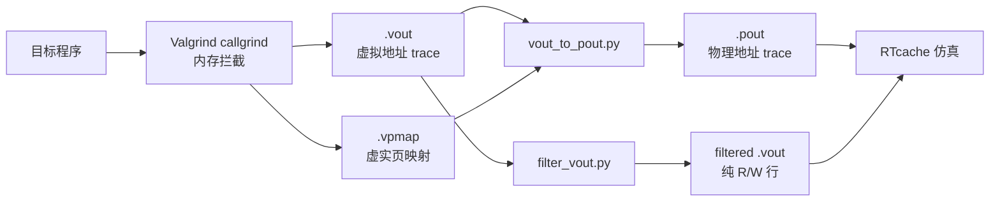

# Trace Generator：内存访问 Trace 采集工具

基于修改版 Valgrind 的内存访问 trace 采集工具，支持虚拟地址和物理地址 trace 生成。本仓库 fork 自 [dgist-datalab/trace_generator](https://github.com/dgist-datalab/trace_generator)，增加了物理地址转换、多格式输出和批量处理等功能。

## 工作流程



## 输出格式

| 文件 | 格式 | 示例 | 用途 |
|------|------|------|------|
| `.vout` | Valgrind 输出 | `[R 1fff000540 769387.698]` | 带时间戳的虚拟地址 trace |
| `.vpmap` | 页映射记录 | `{pid a vpn pfn timestamp}` | 虚实地址映射表 |
| `.pout` | 物理地址 trace | `R 0x3c04ed6e80` | RTcache/gem5 仿真输入 |

## 环境要求

### 修改版 Valgrind（必需）

```bash
git clone https://github.com/dgist-datalab/valgrind_cachetrace.git
cd valgrind_cachetrace
./autogen.sh && ./configure && make && sudo make install
```

### 修改版 Linux 内核（仅物理地址 trace 需要）

物理地址 trace 需要内核 vpmap 模块支持，提供 `/proc/vpmap/vpmap` 接口：

```bash
git clone https://github.com/dgist-datalab/cxl-kernel.git
cd cxl-kernel
cp arch/x86/configs/ubuntu_defconfig .config
make bindeb-pkg -j$(nproc)
sudo dpkg -i linux-image-5.17.4-*.deb linux-headers-5.17.4-*.deb
sudo reboot
```

### Python 依赖

```bash
pip3 install numpy matplotlib
```

## 快速开始

### 采集虚拟地址 trace

```bash
# 直接使用 valgrind
valgrind --tool=callgrind --simulate-wb=yes --simulate-hwpref=no \
    --log-fd=2 ./your_program > proclog.log 2> output.vout

# 或使用采集脚本（需要 sudo）
sudo run_script/modify.sh -t virtual -d /output/dir --outname myapp \
    -i ./your_program
```

### 采集物理地址 trace（需要修改版内核）

```bash
sudo run_script/modify.sh -t physical -d /output/dir --outname myapp \
    -i ./your_program
# 自动生成: myapp.vout + myapp.vpmap + myapp.pout
```

### 后处理工具

```bash
# .vout + .vpmap → .pout（不带时间戳）
python3 after_run/vout_to_pout.py input.vout

# .vout + .vpmap → .pout（带时间戳）
python3 after_run/vout_to_pout.py input.vout --with-timestamp

# 指定 vpmap 文件和输出路径
python3 after_run/vout_to_pout.py input.vout --vpmap custom.vpmap -o output.pout

# 过滤 .vout 为纯 R/W 格式（去掉 Valgrind 头部和括号）
python3 after_run/filter_vout.py input.vout
# 输出: input_filtered.vout

# 生成内存访问热力图
python3 after_run/memory_heatmap.py input.pout
```

### 合成负载测试

```bash
cd test/
sudo ./test_synthetic.sh
# 可选测试程序: indirect_delta, true_random, heap, strided_latjob, hashmap
```

## 仓库结构

```
trace_generator/
├── run_script/
│   ├── run_script.sh          # 原版采集脚本
│   ├── modify.sh              # 改进版采集脚本（支持输出目录、标准输入）
│   ├── modify_ptrace.sh       # 带时间戳版本
│   ├── getopt.sh              # 参数解析（支持 -d/-s 等扩展参数）
│   └── check.sh               # 环境检查
│
├── after_run/
│   ├── vout_to_pout.py        # .vout+.vpmap → .pout（支持 --with-timestamp）
│   ├── filter_vout.py         # .vout → 过滤后纯 R/W 格式
│   ├── memory_heatmap.py      # .pout → 内存访问热力分布
│   ├── make_physical_trace_ts.py       # 原版 v2p 转换（带时间戳）
│   ├── make_physical_trace_parallel.py # 多进程并行 v2p 转换
│   ├── mix_vpmap.py           # 合并 .vout 和 .vpmap 为 .mix
│   ├── vpmap.sh               # 从 /proc/vpmap 导出页映射
│   └── graph/
│       ├── cg_histogram.py    # 虚拟地址分布图
│       └── cg_pa_histogram.py # 物理地址分布图
│
├── test/
│   ├── test_synthetic.sh      # 合成负载测试脚本
│   └── Synthetic_Workload/    # 测试程序源码和二进制
│       ├── true_random.c      # 随机访问模式
│       ├── indirect_delta.c   # 间接增量访问
│       ├── hashmap.cpp        # 哈希表访问
│       ├── heap.c             # 堆访问模式
│       └── strided_latjob.c   # 跨步访问模式
│
├── valgrind/                  # 子模块（修改版 Valgrind，需单独安装）
└── kernel/                    # 子模块（修改版内核，物理 trace 需要）
```

## 采集脚本参数

```bash
sudo run_script/modify.sh [options] -i <program>
```

| 参数 | 说明 |
|------|------|
| `-i, --input <program>` | 目标程序路径（必需，放在最后） |
| `-t, --type <virtual\|physical>` | trace 类型：virtual 仅虚拟地址，physical 含物理地址 |
| `-d, --outdir <dir>` | 输出目录 |
| `--outname <name>` | 输出文件名前缀 |
| `-s, --shuru <file>` | 标准输入重定向（如测试数据文件） |
| `-p, --pref` | 启用 Valgrind 硬件预取模拟 |
| `--nolog` | 不重定向标准输出/错误流 |

## 与 RTcache 的集成

采集到的 trace 文件可直接作为 [RTcache](https://github.com/CGCL-codes/RTcache) 仿真输入，RTcache 支持自动检测以下格式：

- `.pout`（文本）：`R 0xADDR` — 物理地址 trace
- `.vout`：`[R ADDR timestamp]` — 可直接读取，自动跳过 Valgrind 头部
- `.pout`（二进制）：16 字节定长记录

## 致谢

本项目基于 [dgist-datalab/trace_generator](https://github.com/dgist-datalab/trace_generator)，原项目用于 CXL-flash 研究。

## 许可证

Valgrind 和 Linux 内核子模块遵循 GPL v2 许可证。
