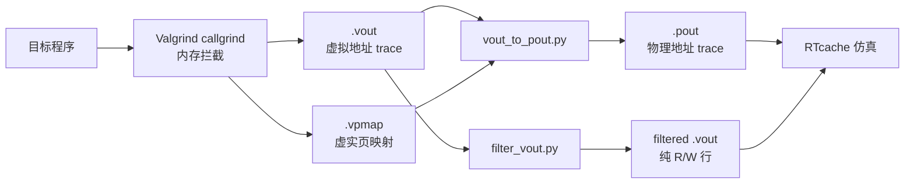
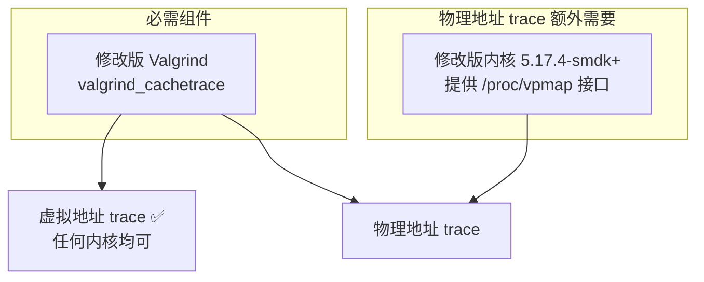

# Trace Generator：内存访问 Trace 采集工具

基于修改版 Valgrind 的内存访问 trace 采集工具，支持虚拟地址和物理地址 trace 生成。本仓库 fork 自 [dgist-datalab/trace_generator](https://github.com/dgist-datalab/trace_generator)，增加了物理地址转换、多格式输出和批量处理等功能。

## 工作流程



## 输出格式

| 文件 | 格式 | 示例 | 用途 |
|------|------|------|------|
| `.vout` | Valgrind 输出 | `[R 1fff000540 769387.698]` | 带时间戳的虚拟地址 trace |
| `.vpmap` | 页映射记录 | `{pid a vpn pfn timestamp}` | 虚实地址映射表 |
| `.pout` | 物理地址 trace | `R 0x3c04ed6e80` | RTcache/gem5 仿真输入 |

## 环境搭建

### 组件总览



| 组件 | 虚拟地址 trace | 物理地址 trace | 说明 |
|------|:---:|:---:|------|
| 修改版 Valgrind | **必需** | **必需** | 拦截内存访问，输出 `.vout` |
| 修改版内核 (5.17.4-smdk+) | 不需要 | **必需** | 提供 `/proc/vpmap` 虚实映射接口 |
| Python 3 + numpy | 不需要 | **必需** | 运行 `vout_to_pout.py` 转换脚本 |

### 1. 安装修改版 Valgrind

```bash
git clone https://github.com/dgist-datalab/valgrind_cachetrace.git
cd valgrind_cachetrace
./autogen.sh
./configure
make -j$(nproc)
sudo make install

# 验证安装
valgrind --version
# 应输出: valgrind-3.20.0.GIT
valgrind --tool=callgrind --help 2>&1 | grep simulate-wb
# 应输出: --simulate-wb=no|yes
```

### 2. 安装修改版内核（仅物理地址 trace 需要）

修改版内核在 `mm/memory.c` 中集成了 vpmap 模块，在页表操作时记录虚拟页号(VPN)→物理页帧号(PFN)的映射关系，通过 `/proc/vpmap/vpmap` 接口导出。

#### 方法 A：从源码编译

```bash
git clone https://github.com/dgist-datalab/cxl-kernel.git
cd cxl-kernel
cp arch/x86/configs/ubuntu_defconfig .config
make bindeb-pkg -j$(nproc)

# 安装
cd ..
sudo dpkg -i linux-image-5.17.4-smdk+_*.deb linux-headers-5.17.4-smdk+_*.deb
sudo reboot
```

#### 方法 B：已编译 deb 包直接安装

如果已有编译好的 `.deb` 文件：

```bash
sudo dpkg -i linux-image-5.17.4-smdk+_*.deb
sudo reboot
```

### 3. 切换内核

物理地址 trace 需要在 `5.17.4-smdk+` 内核下运行。采集完成后可切回普通内核。

#### 临时切换（仅下次启动生效）

```bash
# 查看可用内核
grep "menuentry '" /boot/grub/grub.cfg | cat -n

# 切换到 smdk 内核（通常在 "Advanced options" 子菜单中）
# GRUB_DEFAULT="1> N" 其中 1 表示 Advanced options 子菜单，N 是内核序号
sudo grub-reboot "1> 0"   # 根据实际序号调整
sudo reboot
```

#### 永久设置默认内核

```bash
# 编辑 grub 配置
sudo nano /etc/default/grub

# 修改 GRUB_DEFAULT 为 smdk 内核的 menuentry ID:
# GRUB_DEFAULT="gnulinux-5.17.4-smdk+-advanced-80560c1b-2f58-432f-a7f5-ab89ec8e95d6"
# （UUID 因系统而异，从 grub.cfg 中查找）

sudo update-grub
sudo reboot
```

#### 验证内核切换成功

```bash
# 确认内核版本
uname -r
# 应输出: 5.17.4-smdk+

# 确认 vpmap 接口可用
ls /proc/vpmap/vpmap
# 应显示文件存在

# 确认 target_pid 参数可用
ls /sys/module/memory/parameters/target_pid
# 应显示文件存在
```

#### 切回普通内核

```bash
sudo grub-reboot 0   # 0 通常是最新的普通内核
sudo reboot
```

### 4. 安装 Python 依赖

```bash
pip3 install numpy matplotlib
```

## 使用方法

### 采集虚拟地址 trace（任何内核）

```bash
# 直接使用 valgrind
valgrind --tool=callgrind --simulate-wb=yes --simulate-hwpref=no \
    --log-fd=2 ./your_program > proclog.log 2> output.vout

# 或使用采集脚本（需要 sudo）
sudo run_script/modify.sh -t virtual -d /output/dir --outname myapp \
    -i ./your_program
```

### 采集物理地址 trace（需要 smdk 内核）

#### 完整流程

```bash
# 1. 确认运行在 smdk 内核
uname -r   # 应输出 5.17.4-smdk+

# 2. 确认 vpmap 接口就绪
cat /proc/vpmap/vpmap   # 应无报错
cat /sys/module/memory/parameters/target_pid   # 应输出 0

# 3. 运行采集脚本
sudo run_script/modify.sh -t physical -d /output/dir --outname myapp \
    -i ./your_program

# 脚本自动完成以下步骤:
#   a. 清空页缓存，重置 vpmap
#   b. 启动 valgrind 运行目标程序
#   c. 将 valgrind 进程 PID 写入 /sys/module/memory/parameters/target_pid
#   d. 等待程序结束
#   e. 从 /proc/vpmap/vpmap 导出页映射到 .vpmap
#   f. 运行 vout_to_pout.py 转换为 .pout

# 4. 输出文件:
#    /output/dir/myapp.vout   - 虚拟地址 trace
#    /output/dir/myapp.vpmap  - 虚实页映射
#    /output/dir/myapp.pout   - 物理地址 trace
```

#### 手动执行各步骤（用于调试或自定义流程）

```bash
# 1. 重置 vpmap 缓冲区
echo 0 > /proc/vpmap/vpmap

# 2. 启动 valgrind 采集
valgrind --tool=callgrind --simulate-wb=yes --simulate-hwpref=no \
    --log-fd=2 ./your_program > proclog.log 2> output.vout &

# 3. 注册目标进程 PID
PID=$!
echo $PID > /sys/module/memory/parameters/target_pid

# 4. 等待程序结束
wait $PID

# 5. 导出页映射
cat /proc/vpmap/vpmap > output.vpmap

# 6. 转换为物理地址 trace
python3 after_run/vout_to_pout.py output.vout
# 生成: output.pout
```

#### 带标准输入的程序

```bash
# 使用 -s 参数指定输入文件
sudo run_script/modify.sh -t physical -d /output/dir --outname myapp \
    -s input_data.txt -i ./your_program
```

### 后处理工具

```bash
# .vout + .vpmap → .pout（不带时间戳）
python3 after_run/vout_to_pout.py input.vout

# .vout + .vpmap → .pout（带时间戳）
python3 after_run/vout_to_pout.py input.vout --with-timestamp

# 指定 vpmap 文件和输出路径
python3 after_run/vout_to_pout.py input.vout --vpmap custom.vpmap -o output.pout

# 过滤 .vout 为纯 R/W 格式（去掉 Valgrind 头部和括号）
python3 after_run/filter_vout.py input.vout
# 输出: input_filtered.vout

# 生成内存访问热力图
python3 after_run/memory_heatmap.py input.pout
```

### 合成负载测试

```bash
cd test/
sudo ./test_synthetic.sh
# 可选测试程序: indirect_delta, true_random, heap, strided_latjob, hashmap
```

## 采集脚本参数

```bash
sudo run_script/modify.sh [options] -i <program>
```

| 参数 | 说明 |
|------|------|
| `-i, --input <program>` | 目标程序路径（必需，放在最后） |
| `-t, --type <virtual\|physical>` | trace 类型：virtual 仅虚拟地址，physical 含物理地址 |
| `-d, --outdir <dir>` | 输出目录 |
| `--outname <name>` | 输出文件名前缀 |
| `-s, --shuru <file>` | 标准输入重定向（如测试数据文件） |
| `-p, --pref` | 启用 Valgrind 硬件预取模拟 |
| `--nolog` | 不重定向标准输出/错误流 |

## 仓库结构

```
trace_generator/
├── run_script/
│   ├── run_script.sh          # 原版采集脚本
│   ├── modify.sh              # 改进版采集脚本（支持输出目录、标准输入）
│   ├── modify_ptrace.sh       # 带时间戳版本
│   ├── getopt.sh              # 参数解析（支持 -d/-s 等扩展参数）
│   └── check.sh               # 环境检查
│
├── after_run/
│   ├── vout_to_pout.py        # .vout+.vpmap → .pout（支持 --with-timestamp）
│   ├── filter_vout.py         # .vout → 过滤后纯 R/W 格式
│   ├── memory_heatmap.py      # .pout → 内存访问热力分布
│   ├── make_physical_trace_ts.py       # 原版 v2p 转换（带时间戳）
│   ├── make_physical_trace_parallel.py # 多进程并行 v2p 转换
│   ├── mix_vpmap.py           # 合并 .vout 和 .vpmap 为 .mix
│   ├── vpmap.sh               # 从 /proc/vpmap 导出页映射
│   └── graph/
│       ├── cg_histogram.py    # 虚拟地址分布图
│       └── cg_pa_histogram.py # 物理地址分布图
│
├── test/
│   ├── test_synthetic.sh      # 合成负载测试脚本
│   └── Synthetic_Workload/    # 测试程序源码和二进制
│       ├── true_random.c      # 随机访问模式
│       ├── indirect_delta.c   # 间接增量访问
│       ├── hashmap.cpp        # 哈希表访问
│       ├── heap.c             # 堆访问模式
│       └── strided_latjob.c   # 跨步访问模式
│
├── valgrind/                  # 子模块（修改版 Valgrind，需单独安装）
└── kernel/                    # 子模块（修改版内核，物理 trace 需要）
```

## 常见问题

### Q: `/proc/vpmap/vpmap` 不存在？

当前未运行 `5.17.4-smdk+` 内核。按上方「切换内核」步骤重启到 smdk 内核。

### Q: 物理 trace 中大量地址转换失败（none_cnt 很高）？

可能原因：
1. `.vpmap` 采集不完整 — 确保程序运行期间 target_pid 已正确注册
2. 时间戳对齐偏差 — vpmap 的时间戳粒度可能不够细，`vout_to_pout.py` 使用最近邻匹配

### Q: Valgrind 采集太慢？

Valgrind 拦截所有内存访问，典型减速 20-50 倍。对于大型程序：
- 使用 `--simulate-hwpref=no` 关闭预取模拟（稍快）
- 只采集虚拟地址 trace，后续用 RTcache 直接读取 `.vout`

### Q: 采集完成后如何切回普通内核？

```bash
sudo grub-reboot 0 && sudo reboot
```

## 与 RTcache 的集成

采集到的 trace 文件可直接作为 [RTcache](https://github.com/CGCL-codes/RTcache) 仿真输入，RTcache 支持自动检测以下格式：

- `.pout`（文本）：`R 0xADDR` — 物理地址 trace
- `.vout`：`[R ADDR timestamp]` — 可直接读取，自动跳过 Valgrind 头部
- `.pout`（二进制）：16 字节定长记录

## 致谢

本项目基于 [dgist-datalab/trace_generator](https://github.com/dgist-datalab/trace_generator)，原项目用于 CXL-flash 研究。

## 许可证

Valgrind 和 Linux 内核子模块遵循 GPL v2 许可证。
